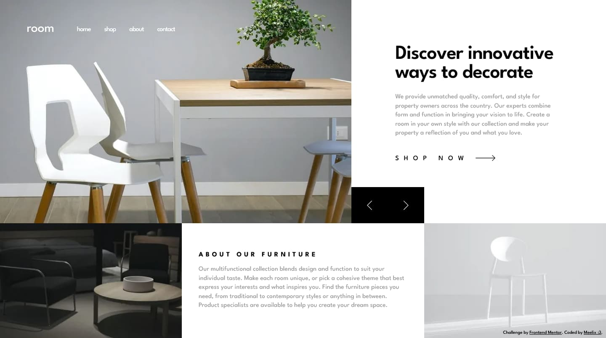
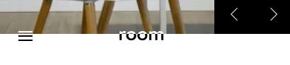

# Frontend Mentor - Room homepage solution

This is a solution to the [Room homepage challenge on Frontend Mentor](https://www.frontendmentor.io/challenges/room-homepage-BtdBY_ENq). Frontend Mentor challenges help you improve your coding skills by building realistic projects. 

## Table of contents

- [Overview](#overview)
  - [The challenge](#the-challenge)
  - [Screenshot](#screenshot)
  - [Links](#links)
- [My process](#my-process)
  - [Built with](#built-with)
  - [What I learned](#what-i-learned)
  - [Useful resources](#useful-resources)
- [Author](#author)

## Overview

### The challenge

Users should be able to:

- View the optimal layout for the site depending on their device's screen size
- See hover states for all interactive elements on the page
- Navigate the slider using either their mouse/trackpad or keyboard

### Screenshot

### Links

- [Solution](https://your-solution-url.com)
- [Live Site](https://github.com/meelix/frontendmentor-challenges/room-homepage)

## My process

### Built with

- Semantic HTML5 markup
- Modern vanilla CSS
- Flexbox
- Css mask & clip-path
- Mobile-first workflow
- Vanilla Js
- [Swiper.js](https://swiperjs.com) - Swiper library

### What I learned

Learned how to implement this fancy ✨ (..useless and poorly performing 🔥) color changing effect

### Useful resources

- [SVG Path Editor](https://yqnn.github.io/svg-path-editor/) - Simple svg path editor
- [Changing Logo Prototype](https://codepen.io/poopsplat/pen/mdOaGwZ) - Wouldn't have been able to to the logo thing

## Author

- Frontend Mentor - [@meelix](https://www.frontendmentor.io/profile/meelix)
- Github - [@meelix](https://github.com/meelix)